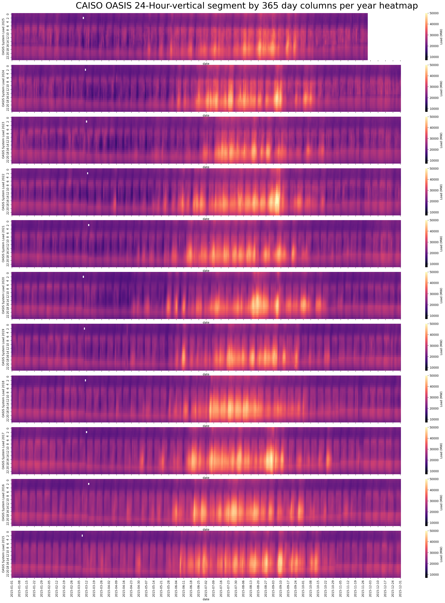
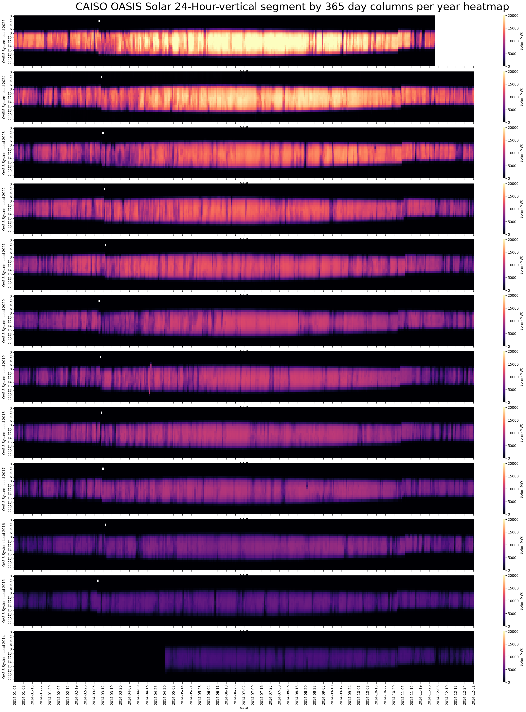
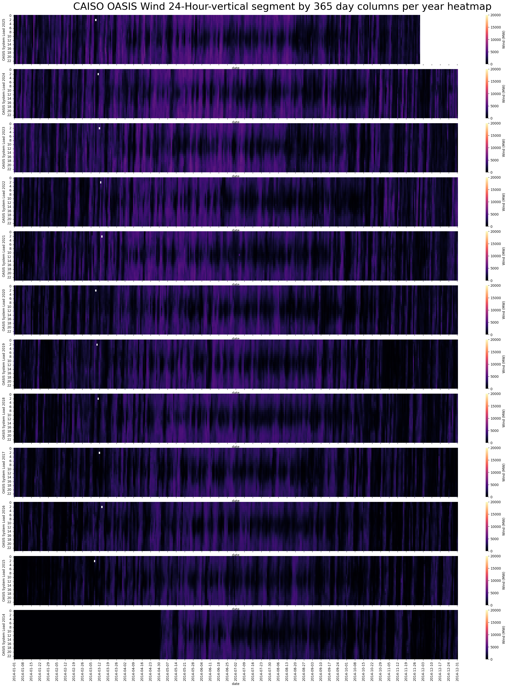

# california-wws-grid
California Wind Water Solar Grid hourly data

## docker-compose 
Using docker-compose builds the Nvidia CUDA ML required packages with the rapidai base image, and enables GPU ML using the Dockerfile.

Docker Jupyter notebooks at localhost:8888 

With this method the image only builds once rather than having to keep reinstalling the Python packages.
```
docker-compose up -d --build
```

#### Docker volume path (change OS username path to your install path)
```
volumes:
      - "/c/Users/(username)/github/california-wws-grid:/home/rapids/notebooks/work"
```

## CAISO output parquet file column data
The caiso output parquet file has cleaned up hourly resampled data from original 5 minute MW data. 

This takes 262 MB of Excel data down to 10 MB.
Additionally to keep the filesize small I rounded all MW columns to the nearest 2 decimal places.
```
Load, Solar, Wind, Net Load, Renewables, Nuclear, Large Hydro, Imports, Generation, Thermal, Load Less (Generation+Imports), hour_index
```

### To use the cleaned up CAISO OASIS hourly load MW from mid 2014-2025 
#### (Updated to 2025-11-30)

```
import pandas as pd
hourly_df4 = pd.read_parquet('./caiso_oasis_14_25.parquet')
hourly_df4
```

<strong>Reference:</strong> CAISO hourly data source:

[https://www.caiso.com/library/production-curtailments-data](https://www.caiso.com/library/production-curtailments-data)

## Make the heatmap below yourself with the OasisHourly.ipynb notebook:
Note the scale is 50,000 MW here:



## Make the Solar heatmap below yourself with the OasisHourly_WWS.ipynb notebook:
Note the scale is 20,000 MW here:



## Make the Wind heatmap below yourself with the OasisHourly_WWS.ipynb notebook:
Note the scale is 6,000 MW here:



